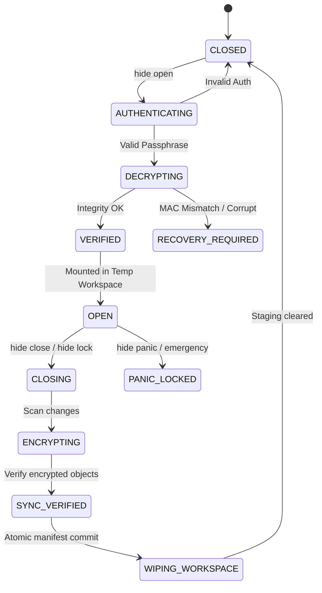

# HIDE — Encrypted Local Vault CLI
## Phase-by-Phase Development Implementation Plan

> **Document Version:** 1.0.0  
> **Target Platform:** Windows 10 / 11 (Desktop CLI & PowerShell Integration)  
> **Primary Reference:** [`docs/hide.md`](file:///c:/Users/frank/OneDrive/Desktop/hide/docs/hide.md)  
> **Security Baseline:** Zero-knowledge authenticated encryption, defense-in-depth, crash resilience.

---

## 1. Executive Overview & Architectural Foundation

`hide` is a high-security desktop Command Line Interface (CLI) platform designed to replace superficial OS-level hiding (such as the Windows hidden attribute) with **cryptographically authenticated, zero-knowledge local vaults**. 

The fundamental thesis is:
> **The software is not the secret. The cryptographic key is the secret.**  
> Without the secret password/passphrase, vault contents are computationally infeasible to decrypt regardless of what software or reverse-engineering techniques are deployed.

```
       +-------------------------------------------------------------+
       |                         hide CLI                            |
       |  (Arg Parsing, Rich UI, Hidden Prompts, Terminal Security)  |
       +------------------------------+------------------------------+
                                      |
       +------------------------------v------------------------------+
       |                     Vault State Manager                     |
       |  (Lifecycle, Transaction Journal, Workspace Mount/Unmount)  |
       +--------------+------------------------------+---------------+
                      |                              |
       +--------------v---------------+ +------------v---------------+
       |      Encryption Engine       | |      Key & KDF Manager      |
       |  (AES-256-GCM, Poly1305,     | |  (Argon2id, Ephemeral Mem,  |
       |   Chunked Stream Cipher)     | |   Zeroize Buffers, Salt)    |
       +--------------+---------------+ +------------+---------------+
                      |                              |
       +--------------v------------------------------v---------------+
       |                      Encrypted Storage                      |
       |  vault.meta | manifest.enc | objects/01/.. (Opaque Blobs)   |
       +-------------------------------------------------------------+
```

---

## 2. Cryptographic & Security Specification

### 2.1 Key Derivation Function (KDF)
- **Algorithm:** **Argon2id** (RFC 9106)
- **Parameters:**
  - Salt: 32 bytes cryptographically secure pseudo-random bytes (`os.urandom(32)` / `crypto.randomBytes(32)`), generated uniquely per vault.
  - Memory Cost ($m$): 64 MB minimum (configurable up to 256 MB for paranoid mode).
  - Time Cost ($t$): 3 iterations minimum.
  - Parallelism ($p$): 4 threads (standard multi-core CPU).
  - Derived Key Length: 256 bits (32 bytes).
- **Rule:** The user password is **never** written to disk, swap, or logs. Secrets in memory must be held in bytearrays that can be zeroized immediately after key derivation.

### 2.2 Authenticated Encryption with Associated Data (AEAD)
- **Algorithm:** **AES-256-GCM** (or ChaCha20-Poly1305 fallback).
- **Key Size:** 256 bits.
- **Nonce (IV):** 96-bit (12 bytes) unique cryptographic nonce generated per object/chunk using a CSPRNG. **Nonces are never reused with the same key.**
- **Authentication Tag:** 128-bit (16 bytes) GCM auth tag appended or prepended to the ciphertext.
- **Associated Data (AAD):** Bound to the Vault ID and Object ID to prevent ciphertext relocation or replay attacks across different vaults.

### 2.3 Vault Storage Layout (Zero-Leakage Design)
Plaintext file names, directory hierarchies, permissions, and exact timestamps must not be visible on the raw filesystem:
```text
<VaultName>.hide/
├── vault.meta          # Public header: Vault UUID, format version, Argon2 parameters, salt, KDF verification tag
├── state.lock          # Atomic lockfile (process PID, lease timestamp, current state)
├── journal.wal         # Write-ahead transaction log for crash recovery
├── manifest.enc        # AES-256-GCM encrypted catalog of directory tree, file mappings, hashes, timestamps
└── objects/            # Content-addressed or randomized encrypted blobs
    ├── a1/
    │   └── a1b2c3d4...enc
    ├── 5f/
    │   └── 5f8e9012...enc
    └── ...
```

---

## 3. Transactional State Machine & Crash Recovery

To ensure that sudden shutdowns, system crashes, or task terminations never result in file corruption or data loss:



### Safety Invariants
1. **Never delete source files** until every file in the directory has been encrypted, written to storage, flushed to physical disk (`fsync`), and verified via AEAD authentication tag check.
2. **Never delete the temporary workspace** on `hide close` until the updated manifest and modified objects are fully committed and verified.
3. If an interrupted state (`ENCRYPTING` or `CLOSING`) is detected during subsequent runs, the system triggers `hide repair` to inspect the Write-Ahead Log (`journal.wal`) and safely restore without data loss.

---

## 4. Phase-by-Phase Development Roadmap

The development is divided into **4 Strategic Milestones** comprising **18 Distinct Phases**.

---

### Milestone 1: Cryptographic Engine & Key Management (Phases 1–5)

#### Phase 1: Vault Architecture & Directory Abstraction
- Define internal domain models: `Vault`, `VaultMetadata`, `ManifestEntry`, `EncryptedObject`, `TransactionState`.
- Establish path canonicalization and directory isolation abstractions to prevent path traversal attacks (`../`, symlink resolution, NTFS junction filtering).
- **Deliverable:** Architecture schema, directory spec, and data models.

#### Phase 2: Cryptographic Core Engine
- Implement the core AEAD wrapper (`AES-256-GCM`):
  - `encrypt_bytes(data: bytes, key: bytes, aad: bytes = None) -> (nonce, ciphertext, tag)`
  - `decrypt_bytes(nonce: bytes, ciphertext: bytes, tag: bytes, key: bytes, aad: bytes = None) -> bytes`
- Implement chunked streaming encryption for large files (64 KB / 1 MB chunks with chunk-indexed nonces) so multi-gigabyte files do not exhaust system RAM.
- **Deliverable:** Standalone crypto module with 100% test coverage against test vectors.

#### Phase 3: Key Derivation & Credential Management
- Implement Argon2id key derivation module with calibrated time/memory settings.
- Implement masked password prompt for CLI (invisible typing or asterisks via Windows console APIs).
- Add double-confirmation validation during initialization.
- Implement ephemeral key holder with explicit zeroing (`ctypes.memset` or zero-fill) on process termination.
- **Deliverable:** `crypto/kdf.py` and credential acquisition utilities.

#### Phase 4: Independent Engine Test Suite
- Comprehensive automated test suite:
  - Round-trip fidelity: `plaintext -> encrypt -> decrypt -> original == plaintext`.
  - Wrong password test (must fail fast with authenticated MAC failure).
  - Bit-flip corruption detection (tampering with 1 byte of ciphertext or tag must abort).
  - Unicode filenames, emoji paths, deep directory structures (Windows 260-char path limit handling).
  - Zero-byte files, multi-gigabyte files, binary executables.
- **Deliverable:** Pytest / Unit test suite with comprehensive edge cases.

#### Phase 5: Vault Metadata & Verification Tag
- Structure `vault.meta`:
  ```json
  {
    "version": 1,
    "vault_id": "7b68630a-d8cb-4e94-8178-98e3b5e40e2b",
    "kdf": {
      "algorithm": "argon2id",
      "salt": "<base64>",
      "memory_cost": 65536,
      "time_cost": 3,
      "parallelism": 4
    },
    "cipher": "aes-256-gcm",
    "auth_check": {
      "nonce": "<base64>",
      "ciphertext": "<base64>",
      "tag": "<base64>"
    }
  }
  ```
- Fast auth pre-check: a small known token encrypted with the derived key verifies password correctness within ~200ms before attempting to unpack multi-gigabyte payloads.
- **Deliverable:** `VaultMetadata` serialization and parsing module.

---

### Milestone 2: Vault Ingestion & Manifest Management (Phases 6–8)

#### Phase 6: `hide init` Command
- CLI command to initialize a new vault in default (`~/.hide/vaults/<name>`) or custom target path.
- Generate cryptographically secure salt, derive key, write `vault.meta`, initialize empty manifest.
- Register vault in local registry (`~/.hide/registry.json`).
- **Deliverable:** Working `hide init [path]` command with confirmation output.

#### Phase 7: `hide .` / `hide pack` (In-Place Ingestion)
- Core workflow: Encrypting an existing folder directly from the terminal.
- Step 1: Scan target directory, compute file count and aggregate size.
- Step 2: Write transaction marker (`state.lock` -> `STATE_ENCRYPTING`).
- Step 3: Stream-encrypt each file into vault object store with opaque UUID filenames.
- Step 4: Encrypt full manifest (paths, permissions, timestamps, sizes, object IDs).
- Step 5: Flush disk buffers and execute full integrity dry-run against written objects.
- Step 6: Securely remove original files only after step 5 passes with zero errors.
- **Deliverable:** Fully functional `hide .` / `hide here` command.

#### Phase 8: `hide list` & Vault Registry
- Query registered vaults from `~/.hide/registry.json`.
- Display formatted table with:
  - Vault Index / ID
  - Friendly Name
  - Disk Path
  - Size on Disk
  - Last Modified / Created Date
  - Current Status: `LOCKED`, `OPEN`, `CORRUPTED`
- Support orphan scan (finding unregistered `.hide` vaults across specified drives).
- **Deliverable:** Clean CLI display using `rich` tables.

---

### Milestone 3: Lifecycle, Workspace Security & Locking (Phases 9–14)

#### Phase 9: `hide open` (Decryption & Workspace Staging)
- Accept vault index or name (`hide open 1` or `hide open ProjectX`).
- Prompt for passphrase, derive key, verify auth check token.
- Decrypt `manifest.enc` into memory.
- Create an isolated staging workspace:
  - Configurable: default in `~/.hide/workspaces/<vault_id>` or custom destination.
  - Set Windows ACL permissions restricting access to the current authenticated Windows user.
- Reconstruct the directory tree and decrypt objects into plaintext files.
- Record PID, lease time, and lock status in `state.lock`.
- **Deliverable:** Seamless unpack & mount workflow.

#### Phase 10: Temporary Workspace Security & Differential Sync
- Monitor workspace for additions, edits, and deletions via timestamp/hash index.
- When closing, perform differential update:
  - Unmodified files are not re-encrypted (fast sync).
  - Modified/new files receive new nonces, are encrypted, and replace stale objects.
  - Deleted files have their corresponding encrypted objects deleted and unreferenced.
- Mitigate data leakage: warn user about background applications locking files before closing.
- **Deliverable:** Differential sync engine with file-watch/snapshot verification.

#### Phase 11: Transactional Crash Recovery Engine
- Detect interrupted operations (`CLOSING`, `ENCRYPTING`) on startup.
- Recovery logic:
  - If source folder still exists intact: purge partial vault objects and reset.
  - If workspace was open during power outage: restore workspace state, offer user choice to re-encrypt or discard.
- Never delete unverified data.
- **Deliverable:** Robust recovery subsystem with automated crash simulation tests.

#### Phase 12: Secure Deletion & Plaintext Minimization
- Implement multi-pass file shredding for plaintext copies where supported (`py-shred` / random byte overwriting + truncation + unlink).
- Document SSD wear-leveling caveats and explain host OS limits transparently in CLI help/docs.
- Optional BitLocker / NTFS encrypted volume integration recommendations for high-assurance environments.
- **Deliverable:** Secure file deletion engine with cleanup routines.

#### Phase 13: `hide close`, `hide lock`, and `hide status`
- `hide close [vault]`: Graceful re-encryption, sync, workspace deletion, status -> `LOCKED`.
- `hide lock [vault]`: Rapid lock (forces file handles closed, executes sync, wipes workspace).
- `hide status [vault]`: Real-time inspection:
  ```text
  Vault:           FinancialRecords
  Status:          LOCKED
  Objects:         1,420
  Vault Size:      412.8 MB
  Encryption:      AES-256-GCM (Argon2id KDF)
  Integrity:       VERIFIED (0 errors)
  ```
- **Deliverable:** Complete lifecycle management commands.

#### Phase 14: Emergency Lock (`hide panic` / `hide lock --all`)
- Global lock command designed for rapid execution under duress.
- Interrogates `~/.hide/workspaces/` for all active locks.
- Concurrently triggers fast unmount and workspace shredding across all vaults.
- Clears CLI session caches and locks down vault registry.
- **Deliverable:** Instant emergency lockdown command.

---

### Milestone 4: Hardening, Integration & Distribution (Phases 15–18)

#### Phase 15: Security Hardening & Edge-Case Auditing
- **Path Traversal Defense:** Strict validation ensuring no file path in `manifest.enc` escapes the workspace root (`../../Windows/System32`, NTFS alternative data streams `:stream`, null-byte injections).
- **Symlink / Junction Protections:** Detect and reject Windows junction points and symbolic links pointing outside the vault boundary.
- **DDoS / Brute Force Throttling:** Incremental time delay (exponential backoff) after repeated failed password attempts to mitigate brute-force guessing.
- **Long Path Support:** Enable `\\?\` prefix support on Windows for paths exceeding 260 characters.
- **Deliverable:** Security hardening patch and offensive fuzzing tests.

#### Phase 16: Windows Environment & Shell Integration
- Add PowerShell cmdlet aliases (`hide`, `hopen`, `hclose`).
- Optional context menu integration ("Open Encrypted Vault Here").
- Address bar integration: running `cmd /k hide .` directly inside Windows File Explorer address bar.
- **Deliverable:** Windows shell helper scripts and terminal completions.

#### Phase 17: Binary Compilation (`hide.exe`)
- Package Python codebase into a standalone, single-file Windows executable `hide.exe` using `PyInstaller` (or Node SEA if JS runtime preferred).
- Strip debug symbols, package native `argon2` and `cryptography` C-extensions.
- Automatic installation helper to append `hide.exe` directory to User `PATH`.
- Verify execution on clean Windows environment without requiring Python to be pre-installed.
- **Deliverable:** Standalone `dist/hide.exe` binary.

#### Phase 18: Security Audit & Penetration Testing
- Deliberate tamper testing:
  1. Header tampering: Modify 1 bit of `vault.meta` -> verify graceful rejection.
  2. Ciphertext tampering: Modify random bytes in `objects/` -> verify MAC tag check fails before writing to disk.
  3. Manifest tampering: Tamper with file size/path -> verify rejection.
  4. Password exhaustion test: Measure execution time against dictionary attacks.
- Generate audit report and formal verification summary.
- **Deliverable:** Audit report document in `docs/security_audit.md`.

---

## 5. Technology Stack & Dependencies

| Component | Choice | Rationale |
|---|---|---|
| **Core Language** | Python 3.11+ (or Node.js 24) | Rapid development, battle-tested cryptographic bindings, rich CLI ecosystem. |
| **Cryptography** | `cryptography` (OpenSSL backend) | FIPS-compliant AES-256-GCM implementation, highly optimized C-extensions. |
| **KDF Engine** | `argon2-cffi` | Official CFFI binding to reference Argon2 implementation, memory-hard against GPU/ASIC. |
| **CLI Framework** | `click` or `typer` + `rich` | Intuitive argument parsing, progress bars for multi-GB encryption, clean dark aesthetics. |
| **File Shredding** | Win32 API / multi-pass zeroize | Direct low-level handle access with `FILE_FLAG_WRITE_THROUGH` to bypass OS cache. |
| **Packager** | `PyInstaller` | Bundles runtime and dependencies into a single portable `hide.exe` for Windows. |

---

## 6. CLI Command Summary

| Command | Arguments / Flags | Description |
|---|---|---|
| `hide init` | `[path] [--name <name>]` | Initialize a new encrypted vault container. |
| `hide .` / `hide here` | `[--name <name>]` | In-place encryption of the current folder into a vault. |
| `hide pack` | `<source_dir> [--dest <path>]` | Encrypt a specified folder into a vault. |
| `hide list` | `[--json]` | List all registered vaults and their operational status. |
| `hide open` | `<id\|name> [--dest <path>]` | Authenticate and decrypt vault into a working workspace. |
| `hide close` | `[id\|name]` | Re-encrypt changes and securely clean up the workspace. |
| `hide lock` | `[id\|name] [--force]` | Immediately lock and unmount an active vault. |
| `hide panic` | *(none)* | Emergency: lock all active vaults across the machine immediately. |
| `hide status` | `[id\|name]` | Display vault integrity, encryption algorithm, and active sessions. |
| `hide verify` | `<id\|name>` | Perform deep cryptographic integrity audit without unpacking. |
| `hide config` | `[key] [value]` | Manage global settings (auto-lock timer, KDF parameters). |

---

## 7. Immediate Next Steps & Execution Order

1. **Step 1:** Confirm runtime environment (Python 3.12 / 3.11 installation or Node.js binary pipeline).
2. **Step 2:** Scaffold project structure:
   ```text
   hide/
   ├── src/
   │   ├── hide/
   │   │   ├── __init__.py
   │   │   ├── cli.py
   │   │   ├── core/
   │   │   │   ├── crypto.py
   │   │   │   ├── kdf.py
   │   │   │   ├── vault.py
   │   │   │   ├── manifest.py
   │   │   │   └── workspace.py
   │   │   └── utils/
   │   │       ├── shred.py
   │   │       └── recovery.py
   ├── tests/
   ├── docs/
   │   ├── hide.md
   │   └── implementation_plan.md
   ├── pyproject.toml
   └── README.md
   ```
3. **Step 3:** Implement Milestone 1 (Crypto & KDF test suite).
4. **Step 4:** Implement Milestone 2 (Vault ingestion & manifest engine).
5. **Step 5:** Implement Milestone 3 (CLI lifecycle commands & workspace management).
6. **Step 6:** Compile and test standalone `hide.exe` on Windows.
